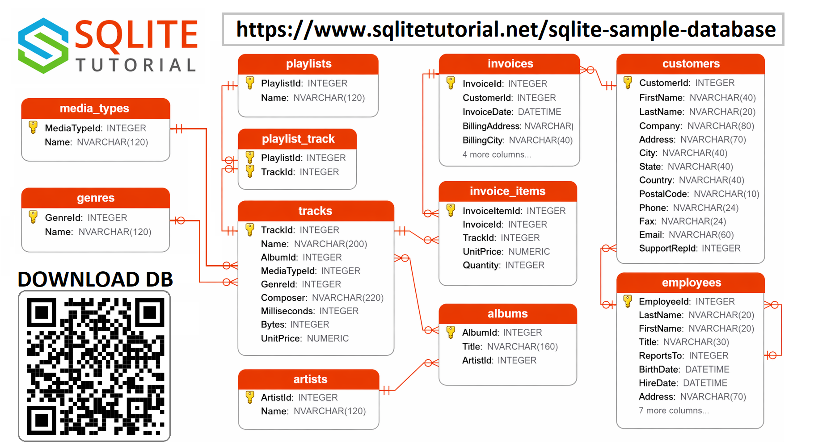
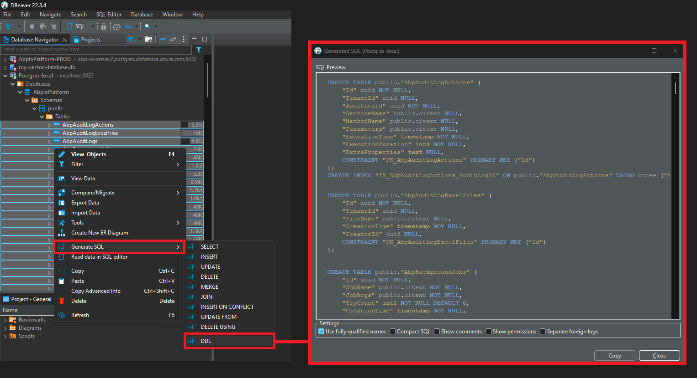

# About The Database
This is a sample SQLite database called `chinook.db`, downloaded at [sqlitetutorial.net/sqlite-sample-database/](https://www.sqlitetutorial.net/sqlite-sample-database/). 
To keep the project simple and understandable, this database is used.

## DB Schema
The `Chinook` sample database contains following tables:

-  `employees` table stores employee data such as id, last name, first name, etc. It also has a field named `ReportsTo` to specify who reports to whom.
-  `customers` table stores customer data.
-  `invoices` & `invoice_items` tables: these two tables store invoice data. The `invoices` table stores invoice header data and the `invoice_items` table stores the invoice line items data.
-  `artists` table stores artist data. It is a simple table that contains the id and name.
-  `albums` table stores data about a list of tracks. Each album belongs to one artist, but an artist may have multiple albums.
-  `media_types` table stores media types such as MPEG audio and AAC audio files.
-  `genres` table stores music types such as rock, jazz, metal, etc.
-  `tracks` table stores the data of songs. Each track belongs to one album.
-  `playlists` & `playlist_track` tables: `playlists` table stores data about playlists. Each playlist contains a list of tracks. Each track may belong to multiple playlists. The relationship between the `playlists` and `tracks` tables is many-to-many. The `playlist_track` table is used to reflect this relationship.

## QUERIES

 ### 🎧 Music & Tracks

   1. What are the top 10 most purchased tracks of all time?
   2. Which genre has the most tracks in the database?
   3. Which album has the most tracks?
   4. Which artist has the most albums?
   5. What is the total duration of tracks in each playlist?

---

   ### 💸 Sales & Revenue

   6. What is the total revenue generated by each customer?
   7. Which country generates the most revenue?
   8. What is the average invoice amount by country?
   9. What are the top 5 selling genres by revenue?
   10. Which employee has the most customers (via sales support)?

---

   ### 👨‍💼 Customers & Employees

   11. Which customers have never made a purchase?
   12. How many customers does each employee support?
   13. Who are the top 5 customers by lifetime value?
   14. How many customers are there per country?
   15. What is the reporting hierarchy of employees (who reports to whom)?

---

   ### 📈 Time-Based Analysis

   16. What is the monthly revenue trend over the last year?
   17. How many invoices were issued each month?
   18. What is the average number of items per invoice over time?
   19. What is the growth rate of customer acquisition per month?
   20. What day of the week generates the most sales?

---

## How to get my database's schema?

In the demo project, I'm using ADO.NET's `GetSchemaAsync()` method. But for one-time usage, you can use [DBeaver](https://dbeaver.io/) application. It's a universal database management studio. 

## How can I open the database?

To explore the data inside the sample `chinook.db` database, you can download the free tool below tool. It's a simple & free app for browsing an SQLite database.

* [sqlitebrowser.org](https://sqlitebrowser.org/)